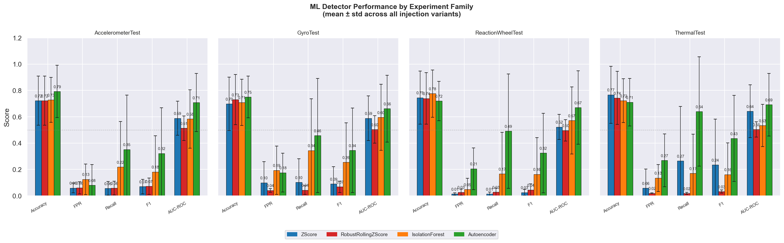
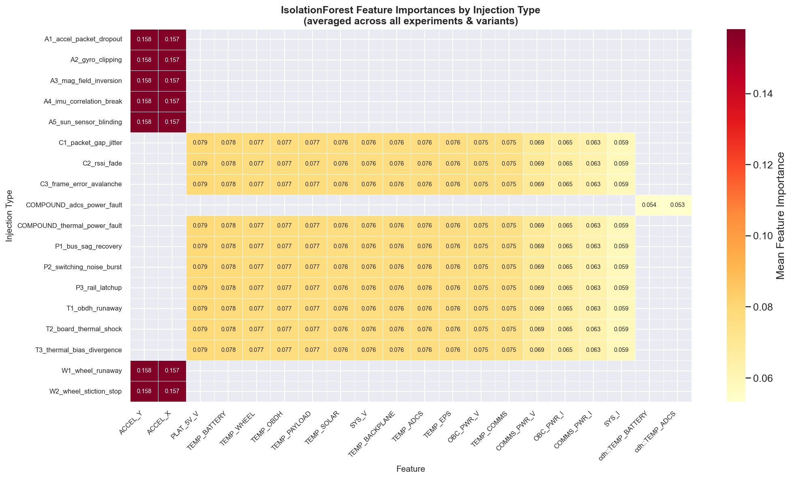
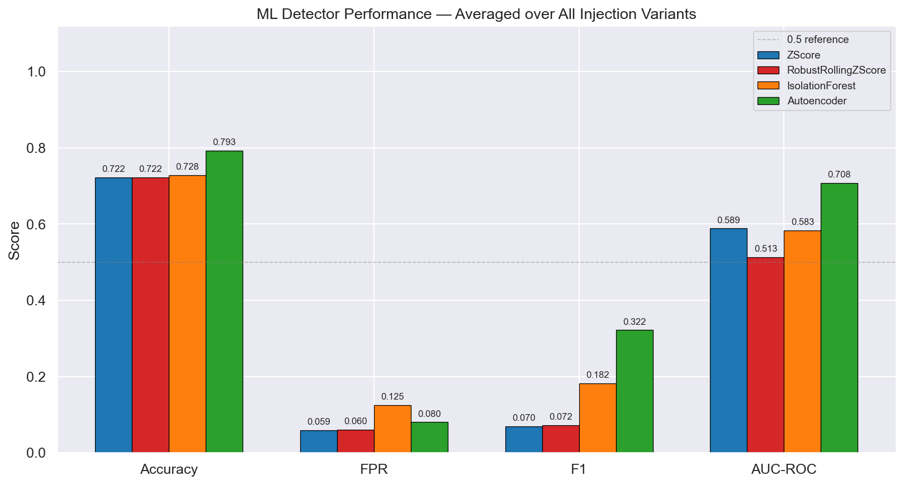
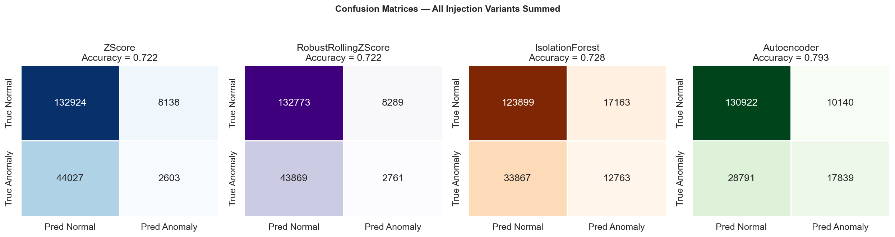
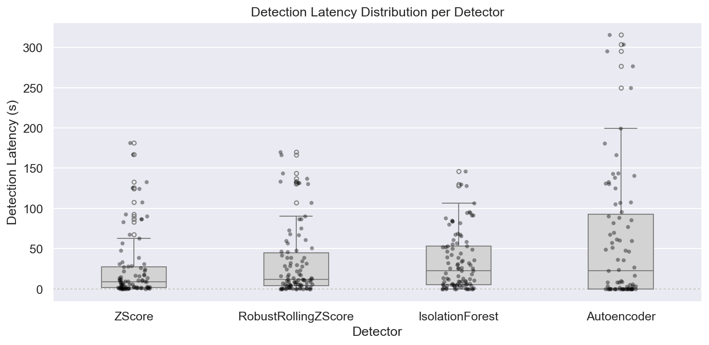
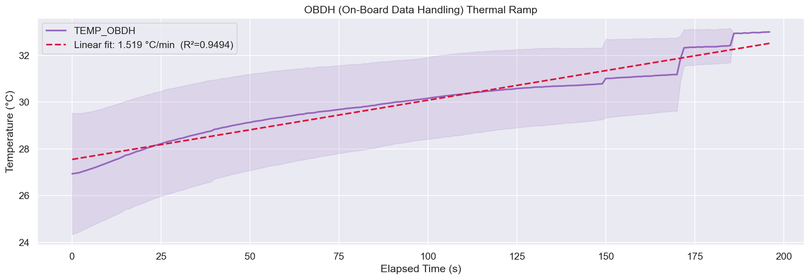

# A Generalizable CubeSat Telemetry Anomaly Detection Pipeline Validated on SATLL

## Abstract
Early anomaly detection in spacecraft telemetry is critical for mission resilience, autonomous operations, and operator workload reduction. This paper presents an end-to-end anomaly detection workflow intended for general CubeSat telemetry operations and validates it using data from the KISPE Satellite Learning Laboratory (SATLL), a CubeSat-like flatsat platform with power, thermal, communication, and ADCS telemetry streams. We combine deterministic data processing, synthetic fault injection informed by prior anomaly detection research, and four machine-learning detectors: hybrid Z-score, robust rolling Z-score, rotation-ensemble Isolation Forest, and a multi-scale denoising autoencoder. Evaluation is performed across four experiment families (AccelerometerTest, GyroTest, ReactionWheelTest, ThermalTest), using tiered anomaly difficulty (easy, medium, hard) and threshold-based metrics (accuracy, false-positive rate, recall, F1, AUC-ROC). The latest full rerun shows clear tier stratification in mean accuracy (easy 0.841, medium 0.729, hard 0.638), with Autoencoder providing the best overall tradeoff (F1 0.356, AUC-ROC 0.683). We discuss strengths, current limitations, and a path to flight-grade validation.

## 1. Introduction
Satellite telemetry anomaly detection has shifted from purely rules-based thresholding toward hybrid and learning-based methods that can capture nonlinear, contextual, and multivariate behavior. In this work, SATLL is used as the development and validation test environment for a pipeline designed to transfer to broader CubeSat telemetry operations.

This work addresses three goals:

1. Build and maintain a reproducible telemetry processing pipeline from raw archive files to evaluation artifacts.
2. Create a synthetic anomaly framework informed by established anomaly-detection research and benchmark pitfalls.
3. Compare baseline and advanced anomaly detectors under controlled, tiered anomaly difficulty.

The motivation is aligned with current concerns in space systems AI: reducing missed anomalies while containing false alarms, and improving robustness under subsystem coupling, temporal drift, and mixed operating regimes.

## 2. Background
### 2.1 SATLL Platform and Telemetry Context
The Satellite Learning Laboratory (SATLL) is a modular satellite analogue system including electrical power (EPS), on-board data handling (OBDH), communications, and attitude determination/control components. Data are logged at 1 Hz from multiple subsystems and exported in analysis/debug text formats.

The telemetry channels emphasized for subsystem-level anomaly framing are summarized below.

| Subsystem | Mnemonic | Description | Indicator | Representative anomaly |
|---|---|---|---|---|
| EPS | OBC_PWR | OBC power rail | Voltage drift/drop | Bus instability, solar underperformance |
| EPS | TEMP_EPS | EPS temperature | Thermal deviation | Power subsystem overheating |
| Battery | TEMP_BATTERY | Battery temperature | Rapid rise/instability | Thermal runaway, inefficiency |
| OBDH | TEMP_OBDH | OBDH board temperature | Sustained heating | CPU overuse, poor dissipation |
| OBDH | CMD_REJ_CNT | Command reject counter | Rate increase | Software instability, comm fault |
| ADCS | TEMP_ADCS | ADCS temperature | Sustained rise | Sensor or actuator inefficiency |
| ADCS | TEMP_WHEEL | Reaction wheel temperature | Heat buildup/vibration | Bearing friction, control saturation |
| COMMS | RSSI | Received signal strength | Drop below threshold | Misalignment, interference |
| COMMS | FRAME_ERR | Frame error count | Spike/burst increase | Link degradation, radiation effects |

Source basis: internal project telemetry specification and SATLL project notes in this repository.

### 2.2 Data and Processing Assumptions
The pipeline ingests SCOTTI archive exports, prefers high-precision analysis logs, and falls back to debug logs when needed. Cleaning includes hex decoding, type coercion, timestamp deduplication, and selected feature derivations (including elapsed-time and rail-level power approximations). These steps were designed to maximize comparability across test families while preserving reproducibility.

## 3. Related Work
This project decision process drew from two categories of literature: (i) space telemetry anomaly detection practice, and (ii) robust/general anomaly detection methods.

### 3.1 Space Telemetry and Spacecraft AD
- OPS-SAT benchmark work provides a contemporary public reference for anomaly detection in spacecraft telemetry datasets [1].
- LSTM-based spacecraft anomaly detection with nonparametric thresholding emphasizes temporal context and practical false-alarm behavior in mission settings [2].

### 3.2 Benchmarking and Evaluation Cautions
- Real-time anomaly scoring and anomaly-window-aware evaluation were influenced by NAB guidance [3].
- Concerns that synthetic benchmark design can create an illusion of progress motivated our multi-morphology, tiered, contextual injection design [4].

### 3.3 Statistical and ML Detector Foundations
- Modified Z-score and robust scale estimation (MAD and alternatives) guided robust statistics in baseline detectors [5][6][7].
- CUSUM change detection informed persistence-sensitive drift handling [8].
- Isolation Forest and Extended Isolation Forest informed our tree-based model direction and axis-alignment mitigation strategy [9][10].
- Multi-sensor sequence anomaly modeling and multiscale representations informed the autoencoder redesign [2][11][12].

## 4. Methodology
### 4.1 End-to-End Pipeline
The project pipeline consists of:

1. Parse: analysis/debug ingestion with timestamp normalization.
2. Clean: numeric decoding, coercion, deduplication, channel sanity checks.
3. Feature generation: raw channels, first-order deltas, rolling descriptors.
4. Injection: synthetic faults over contextual windows with tiered difficulty.
5. Detection: model fitting on clean prefixes and scoring over injected sequences.
6. Evaluation: threshold metrics and visual diagnostics written per family.

### 4.2 Synthetic Fault Injection Design
We use 16 primary anomaly types plus compound cases across thermal, power, ADCS, wheel, timing, and comms channels. Instead of scaling only one amplitude parameter, each tier co-varies duration, amplitude, channel spread, and temporal structure.

Tier semantics used in evaluation:

- Easy: strongest, more persistent, and more detectable perturbations.
- Medium: intermediate perturbation scale and duration.
- Hard: subtler, shorter, or more context-confusable perturbations.

This design is intended to preserve detectable stratification while avoiding unrealistic separability [3][4].

### 4.3 Detector Suite
Four detectors are evaluated using a consistent train/evaluate protocol.

| Detector | Core idea | Method update |
|---|---|---|
| ZScore | Parametric + robust outlier scoring | Fusion of classic z-score with modified z-score (MAD) [5][6][7] |
| RobustRollingZScore | Robust streaming thresholding | Rolling median/MAD plus bounded CUSUM-inspired persistence [5][8] |
| IsolationForest | Tree-based isolation | Rotation ensemble to reduce axis-alignment artifacts (EIF-inspired) [9][10] |
| Autoencoder | Reconstruction-based anomaly scoring | Multi-scale temporal windows with denoising training perturbations [2][11][12] |

### 4.4 Training and Evaluation Protocol
For each family and injected scenario:

- Training data: first 60% of the clean telemetry stream.
- Threshold selection: 99th percentile of training anomaly score distribution.
- Evaluation set: full injected stream with known anomaly windows.
- Metrics: Accuracy, FPR, Recall, F1, AUC-ROC.

The aggregation in this manuscript is computed from current `results/*/injected/ml_metrics_by_tier.csv` artifacts (48 model-tier-family records).

## 5. Results
### 5.1 Aggregate Performance by Detector
Latest full-rerun means across families and tiers:

| Detector | Accuracy | FPR | Recall | F1 | AUC-ROC |
|---|---:|---:|---:|---:|---:|
| Autoencoder | 0.743 | 0.183 | 0.485 | 0.356 | 0.683 |
| IsolationForest | 0.734 | 0.125 | 0.225 | 0.190 | 0.571 |
| RobustRollingZScore | 0.734 | 0.037 | 0.037 | 0.054 | 0.504 |
| ZScore | 0.733 | 0.057 | 0.109 | 0.105 | 0.585 |

Interpretation:

- Autoencoder gives the strongest anomaly recovery (highest Recall/F1/AUC) with moderate false-positive burden.
- Robust rolling baseline is conservative (lowest FPR) but currently under-detects anomalies (very low Recall).
- IsolationForest and ZScore provide comparable accuracy with different FPR/Recall tradeoffs.

### 5.2 Difficulty-Tier Stratification
| Tier | Mean Accuracy | Mean FPR | Mean Recall | Mean F1 | Mean AUC-ROC |
|---|---:|---:|---:|---:|---:|
| Easy | 0.841 | 0.100 | 0.233 | 0.137 | 0.619 |
| Medium | 0.729 | 0.105 | 0.209 | 0.184 | 0.571 |
| Hard | 0.638 | 0.097 | 0.200 | 0.208 | 0.568 |

The expected ordering in accuracy (easy > medium > hard) is observed, indicating that tier controls produce measurable and consistent difficulty separation.

### 5.3 Family-Level Summary
| Family | Accuracy | FPR | Recall | F1 | AUC-ROC | Easy-tier Accuracy |
|---|---:|---:|---:|---:|---:|---:|
| AccelerometerTest | 0.741 | 0.081 | 0.171 | 0.161 | 0.598 | 0.855 |
| GyroTest | 0.722 | 0.127 | 0.237 | 0.189 | 0.588 | 0.819 |
| ReactionWheelTest | 0.745 | 0.074 | 0.175 | 0.139 | 0.565 | 0.860 |
| ThermalTest | 0.736 | 0.120 | 0.273 | 0.216 | 0.593 | 0.830 |

Autoencoder is the highest-F1 detector in all four families in the latest run.

### 5.4 Figures and Visual Evidence
The following generated figures are included as report evidence and can be directly reused in manuscript layout:

Figure 1. Family-level detector metrics (aggregated)

Figure 2. Isolation Forest feature importance heatmap across injection types (artifact currently invalid)

Figure 3. Example per-family detector comparison (AccelerometerTest)

Figure 4. Example per-family confusion matrices (AccelerometerTest)

Figure 5. Example latency distribution (AccelerometerTest)

Figure 6. Baseline thermal ramp behavior (AccelerometerTest anomaly diagnostics)

## 6. Limitations and Future Work
### 6.1 Current Limitations
1. Synthetic-to-real gap: injected faults are research-informed but still simulated; flight-like fault evolution may differ.
2. Fixed thresholding policy: using the 99th percentile for all detectors/families is simple but may not be optimal per subsystem.
3. Detector calibration disparity: some robust baselines are currently under-sensitive relative to autoencoder performance.
4. Limited explainability: current outputs are primarily score/metric based and do not yet provide root-cause narratives.
5. Dataset scope: experiments are constrained to available SATLL sessions and channel sets in this repository snapshot.

### 6.2 Future Work
1. Validate on external/flight telemetry (or public spacecraft datasets) to quantify transferability.
2. Add adaptive threshold calibration by subsystem and operating regime.
3. Introduce explainable AI overlays (feature attribution, counterfactual traces, subsystem fault hypotheses).
4. Expand telemetry domains to ground-station and constellation-level operations.
5. Add uncertainty-aware alerting and operational cost-based evaluation (missed anomaly cost vs false alarm cost).

## 7. Conclusion
This work delivers a reproducible, end-to-end anomaly detection pipeline for general CubeSat telemetry, with SATLL serving as the development and validation environment. The current evaluation shows clear difficulty-tier stratification and strong multivariate performance from the multi-scale autoencoder, while also revealing conservative behavior in robust statistical baselines that motivates further calibration. The resulting code-and-artifact workflow is suitable as a pre-publication foundation and provides a concrete path toward explainable, transferable, and operations-aware anomaly detection for small-satellite systems.

## References
[1] Ruszczak, B., et al. (2025). The OPS-SAT benchmark for detecting anomalies in satellite telemetry. Scientific Data, 12(1), 710.

[2] Hundman, K., Constantinou, V., Laporte, C., Colwell, I., & Soderstrom, T. (2018). Detecting Spacecraft Anomalies Using LSTMs and Nonparametric Dynamic Thresholding. Proceedings of the 24th ACM SIGKDD International Conference on Knowledge Discovery & Data Mining. https://doi.org/10.1145/3219819.3219845

[3] Lavin, A., & Ahmad, S. (2015). Evaluating Real-time Anomaly Detection Algorithms: The Numenta Anomaly Benchmark. 2015 IEEE 14th International Conference on Machine Learning and Applications (ICMLA). https://doi.org/10.1109/ICMLA.2015.141

[4] Wu, R., & Keogh, E. (2022). Current Time Series Anomaly Detection Benchmarks are Flawed and are Creating the Illusion of Progress. IEEE Transactions on Knowledge and Data Engineering. https://doi.org/10.1109/TKDE.2021.3112126

[5] Iglewicz, B., & Hoaglin, D. C. (1993). How to Detect and Handle Outliers. ASQC Quality Press.

[6] Rousseeuw, P. J., & Croux, C. (1993). Alternatives to the Median Absolute Deviation. Journal of the American Statistical Association, 88(424), 1273-1283. https://doi.org/10.1080/01621459.1993.10476408

[7] NIST/SEMATECH e-Handbook of Statistical Methods. Outlier Detection and Modified Z-Score Guidance. https://www.itl.nist.gov/div898/handbook/

[8] Page, E. S. (1954). Continuous Inspection Schemes. Biometrika, 41(1/2), 100-115. https://doi.org/10.1093/biomet/41.1-2.100

[9] Liu, F. T., Ting, K. M., & Zhou, Z.-H. (2008). Isolation Forest. 2008 Eighth IEEE International Conference on Data Mining. https://doi.org/10.1109/ICDM.2008.17

[10] Hariri, S., Carrasco Kind, M., & Brunner, R. J. (2021). Extended Isolation Forest. IEEE Transactions on Knowledge and Data Engineering, 33(4), 1479-1489. https://doi.org/10.1109/TKDE.2019.2947676

[11] Malhotra, P., et al. (2016). LSTM-based Encoder-Decoder for Multi-sensor Anomaly Detection. arXiv:1607.00148.

[12] Zhang, C., Song, D., Chen, Y., et al. (2018). A Deep Neural Network for Unsupervised Anomaly Detection and Diagnosis in Multivariate Time Series Data (MSCRED). arXiv:1811.08055.

[13] Hampel, F. R. (1974). The Influence Curve and Its Role in Robust Estimation. Journal of the American Statistical Association, 69(346), 383-393.

## Reproducibility Note
This manuscript reflects repository outputs generated by the current pipeline configuration and latest full rerun in this workspace. To refresh results before submission, rerun the pipeline and regenerate metric tables from the `results/*/injected/ml_metrics_by_tier.csv` files.
